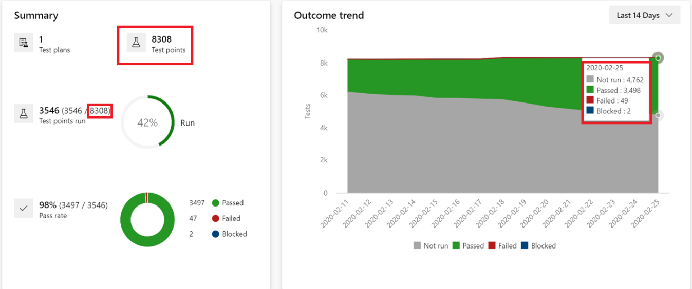
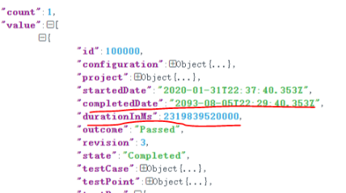
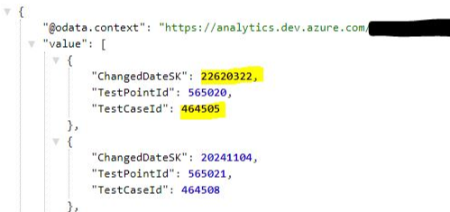

#### RCA: Test Points, Test Results and Timestamps

Over the last month or so we have been receiving a lot of customer tickets related to mismatch in test point counts in Progress Report, or the test result timestamp being in the future(!) or the test result chart showing incorrect data etc.

Here are some developer community tickets related to this issue,  
[Difference between Test Plan Outcome and Progress Report outcome](https://developercommunity.visualstudio.com/content/problem/910841/difference-between-test-plan-outcome-and-progress.html)  
[TestPoint Analytics Data showing incorrect ChangedDateSK
](https://developercommunity.visualstudio.com/content/problem/937319/testpoint-analytics-data-showing-incorrect-changed.html)  
[Test Point API is returning incorrect completion test date
](https://developercommunity.visualstudio.com/content/problem/899262/test-point-api-is-returning-incorrect-completion-t.html)  

Before we delve into what caused this issue and how we fixed it, let's spend some time in understanding the issue and what scenarios users saw broken.

- In the Progress Report page, users would see that the count on the trend chart does not match the count in the Summary tab. For example, in the below screenshot the numbers in the Outcome trend chart add up to 8311; but the Summary card we show the total as 8308. So there is a difference of 3 test points.
  
- The test results REST API was returning incorrect value for ```completedDate``` and ```durationInMs``` fields.  

- The Test Progress Analytics API would return a wrong date.  

- Any test point or test result related chart created for a suite in the ```Charts``` tab would again show similar mismatches in terms of number of test points

#### Root Cause
This problem was caused by a seemingly innocuous change that was made for the automated test results scenario. Unfortunately, the code path was also used for Manual tests and that broke our scenario.

The bug in automated scenario was that the test results' duration was being set to 0 even though the client was passing the duration value when updating the test result status. The fix was simple, use the duration value to compute the results' ```CompletedDate```. Here's the snippet of code that fixed this issue:
```
if (context.IsFeatureEnabled(DurationPriorityWhenPresent) && 
      resultModel.DurationInMs > 0)
{
    resultUpdateRequest.TestCaseResult.DateCompleted =
      resultUpdateRequest.TestCaseResult.DateStarted.AddTimeSpan(
        TimeSpan.FromMilliseconds(resultModel.DurationInMs));
}
```

Now, due to unknown historical reasons, Manual Testing scenario had a weird logic when it came to computing the duration of the test result. Manual testing always used the ```startDate``` and ```completedDate``` fields separately and both these fields would be sent from the client side code.  

The ```duration``` field on the other hand was being multiplied by 10,000 on the client side and sent to server. I'm assuming whoever did this wanted to convert the value from millisecond to ticks maybe. And when the client wanted to render the duration it would divide the value from server by 10,000 and then treat the resultant value in milliseconds and show it appropriately. Things were all working fine until the above change went it. When the above change went live, this is what happened for manual testing scenario.  
- If you ran the web runner for 10 seconds (= 10,000ms); the client would call the results API by multiplying this duration by 10,000. So the value that would get sent to the server was 10,000 * 10,000. 
- Now if the server treated this value as ticks, it may have been alright still but with the above change, the duration value was being read in milliseconds; so the value really became 10,000*10,000 Milliseconds!
- Now depending on how long you kept the web runner running for the manual test run, the computed value would be far ahead in the future; like you see in the screenshots above.  

The code change mentioned above went live around 22nd Jan, 2020 and the actual fix for the issue went live on 22nd Feb, 2020. All manual test runs that were done within this window all had issues with duration timestamps.

#### Snowball effect
What further amplified and made this problem worse,
- The test result data is stored in a micro-service called TCM service
- Most of Manual test scenarios are powered from within the TFS service
- We have a scheduled sync-job that runs on TFS and pulls in data about test points (and test results) from TCM service and updates it in TFS
- All of Manual Test analytics, including ```Progress Report```, is powered by data from TFS
- Now since the wrong timestamps got sync'ed to TFS as well, it broke a lot of Manual Test scenarios

#### Fix
The fix was simple once we knew what the issue was. We added a conditional check in the above code so that it would update the date only if the run was for automated tests.

#### Mitigation
For Manual test customers who performed a test run between the impact period, we had to go and fix up the timestamp enteries in the TCM and TFS database.

#### Prevention
We've since added tests for this scenario so that in future we can catch this before it can impact customers on production.
